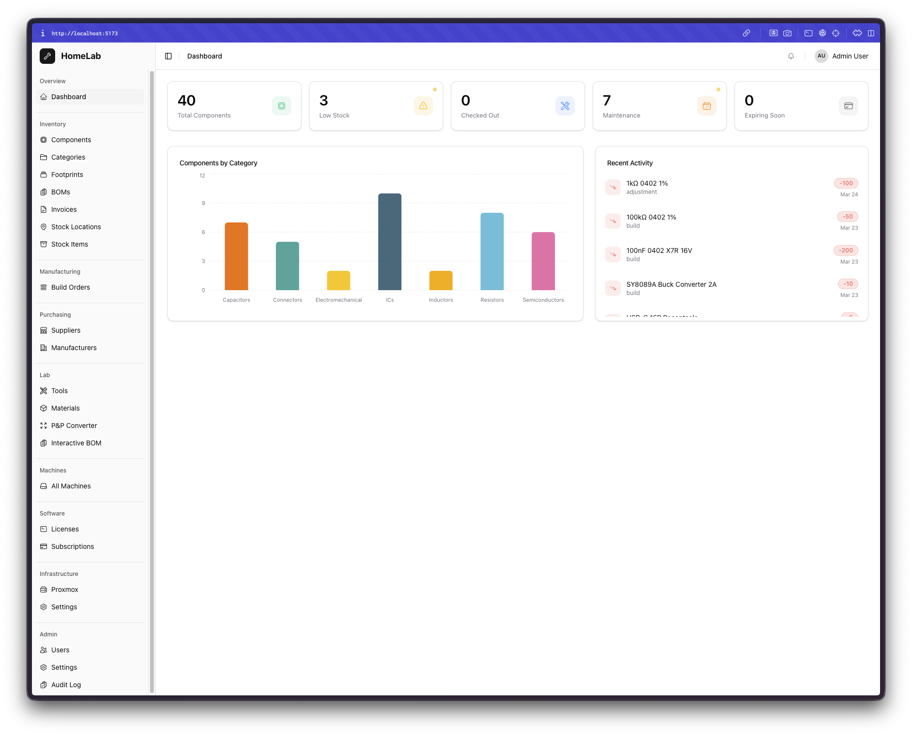
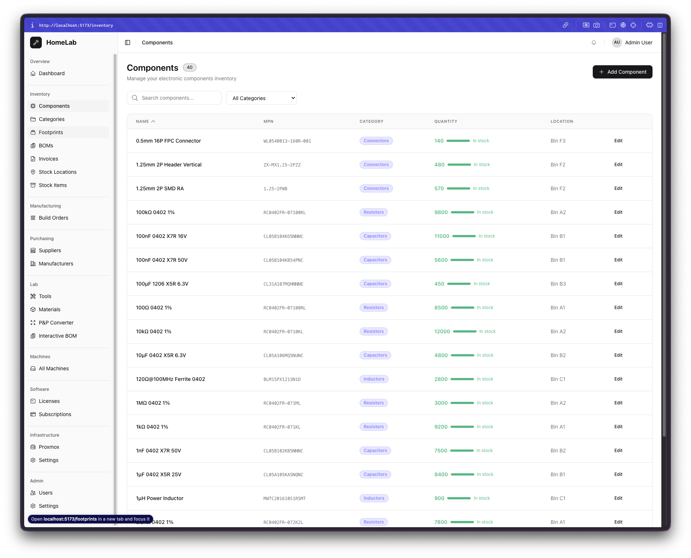
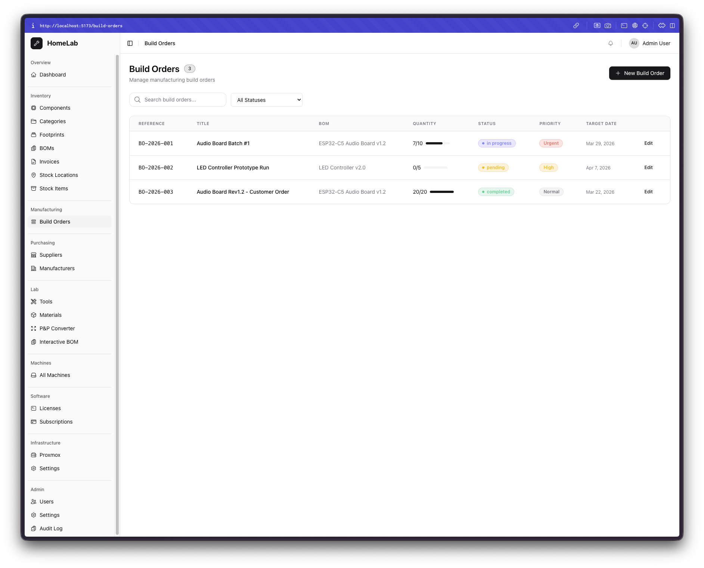
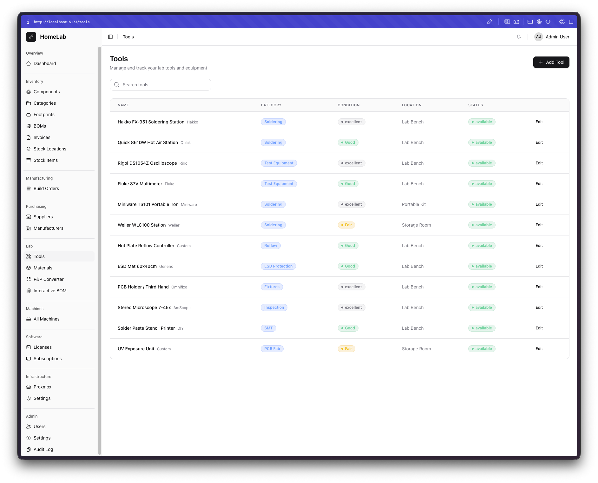
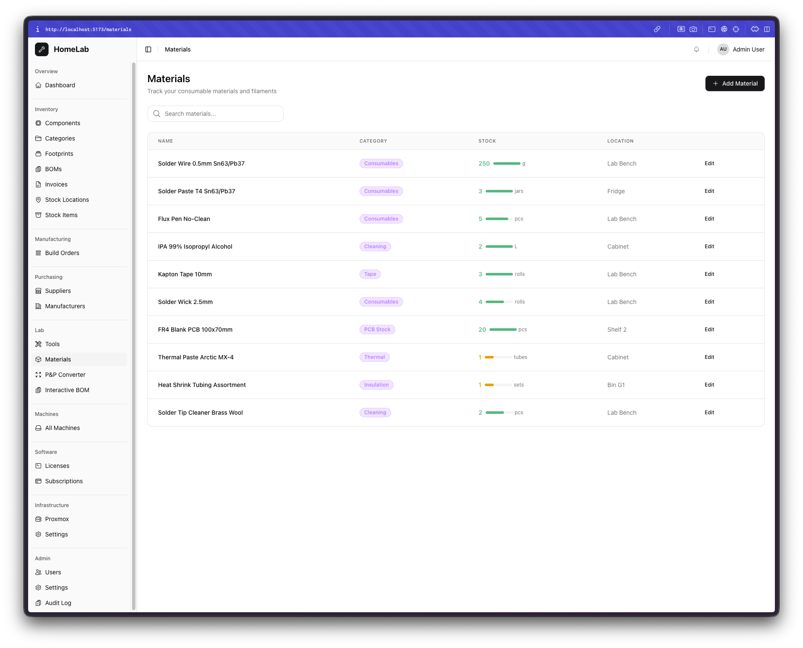
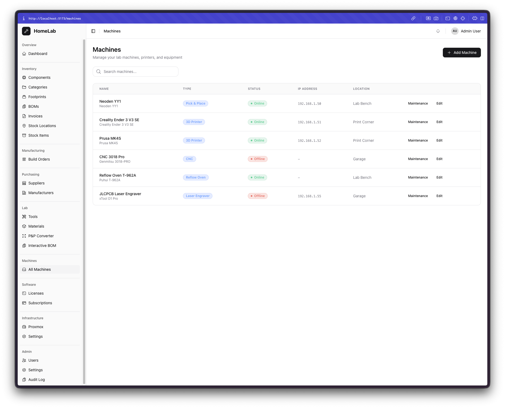
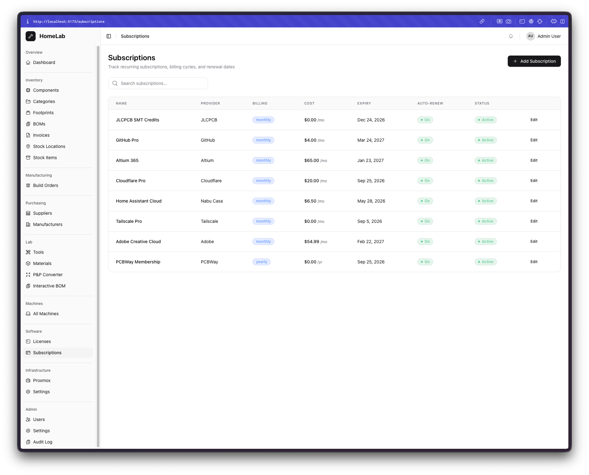
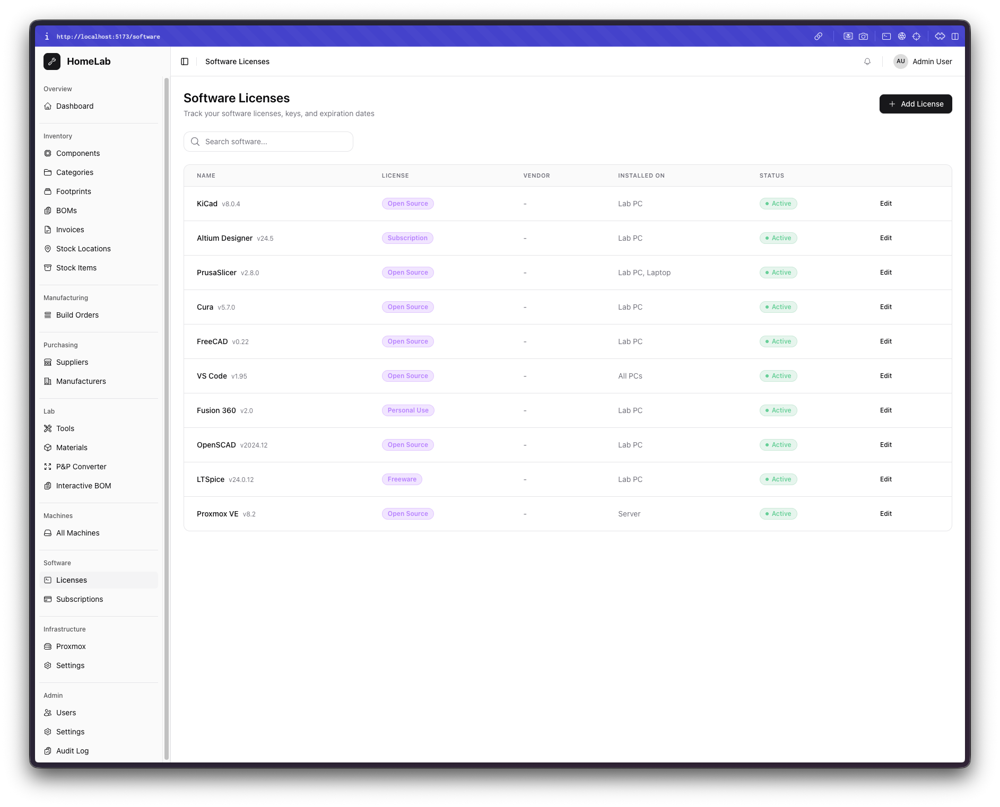
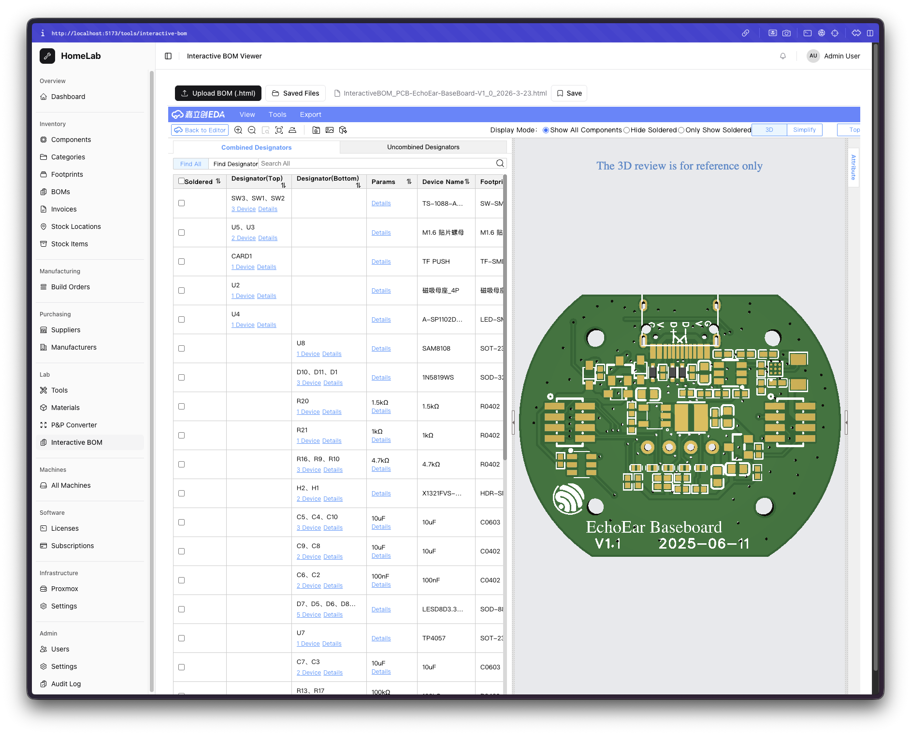

# HomeLab Manager

A self-hosted platform for managing electronics homelab inventory, PCB assembly workflows, machines, software licenses, and infrastructure — all from a single dashboard.

Built for makers, hardware engineers, and homelab enthusiasts who need to track components, manage BOMs, process invoices, and prepare pick-and-place files without relying on spreadsheets.

---

## Screenshots

<p align="center">
  
</p>
<p align="center"><em>Dashboard — at-a-glance stats, component breakdown by category, and recent stock activity</em></p>

<details>
<summary><strong>More screenshots</strong></summary>

<br>

| | |
|:---:|:---:|
|  |  |
| **Components** — full inventory with search, category filters, stock levels | **Build Orders** — track manufacturing runs with progress and priority |
|  |  |
| **Tools** — lab equipment with condition tracking and checkout status | **Materials** — consumables and supplies with stock level indicators |
|  |  |
| **Machines** — P&P, 3D printers, CNC with online status and maintenance | **Subscriptions** — recurring services with billing cycles and renewal dates |
|  |  |
| **Software Licenses** — track installed software, license types, and keys | **Interactive BOM** — embedded JLCPCB/EasyEDA BOM viewer with 3D PCB view |

</details>

---

## Features

### Inventory Management
- **Component Tracking** — catalog parts with manufacturer/supplier part numbers, stock levels, footprints, and categories
- **Bill of Materials** — upload and manage BOMs, check component availability across your inventory
- **Stock Locations** — organize stock across shelves, bins, and storage locations with hierarchical nesting
- **Invoice Processing** — upload PDF invoices (parsed with AI via Claude) or LCSC order CSVs (auto-parsed) to extract items and match against inventory

### PCB Assembly Tools
- **Pick & Place Converter** — upload P&P files from KiCad, EasyEDA, Eagle, or Altium; calibrate coordinates to your machine; export YY1 CSV for Neoden machines. Full session save/restore for re-editing calibration and feeder assignments
- **Interactive BOM Viewer** — upload JLCPCB/EasyEDA Interactive BOM HTML files and view them fully functional inside the platform, with save/load for later retrieval

### Lab & Equipment
- **Tools & Materials** — track lab tools, consumables, and checkout history
- **Machines** — manage 30+ machine types (P&P, 3D printers, CNC, reflow ovens, test equipment, servers, and more) with maintenance logs and scheduling
- **Build Orders** — plan and track PCB assembly builds with component allocation

### Purchasing
- **Suppliers & Manufacturers** — maintain a directory with linked parts and pricing

### Software & Infrastructure
- **Software Licenses** — track license keys, expiry dates, and seat counts
- **Subscriptions** — manage recurring SaaS and service subscriptions
- **Proxmox Integration** — monitor VMs/containers and node status from homelab Proxmox servers

### AI-Powered
- **Invoice Parsing** — upload a PDF invoice and Claude extracts supplier, items, quantities, and prices automatically
- **LCSC CSV Import** — drag-and-drop LCSC order exports for instant inventory matching
- **Smart Autocomplete** — AI-assisted text fields across all forms (descriptions, notes) using context from other form fields

### Platform
- **Authentication** — user accounts with role-based access (admin/user)
- **Audit Log** — track changes across the system
- **Dark/Light/System Theme** — full theme support
- **Responsive UI** — collapsible sidebar, works on desktop and tablet
- **File Management** — save and retrieve uploaded files (BOMs, P&P sessions, invoices) for later use

---

## Architecture

```
homelabmanager/
├── backend/                # Python FastAPI server
│   ├── app/
│   │   ├── main.py         # App entrypoint, lifespan, router registration
│   │   ├── config.py       # Settings (env-based via pydantic-settings)
│   │   ├── database.py     # SQLAlchemy engine, session, Base
│   │   ├── dependencies.py # DI: get_db, get_current_user, require_admin
│   │   ├── models/         # SQLAlchemy ORM models
│   │   ├── schemas/        # Pydantic request/response schemas
│   │   ├── routers/        # API route handlers (one per domain)
│   │   ├── services/       # Business logic (invoice parser, P&P converter, AI)
│   │   └── utils/          # File handling, helpers
│   ├── alembic/            # Database migrations
│   ├── seed_demo.py        # Demo data seeder for development
│   ├── requirements.txt
│   └── Dockerfile
├── frontend/               # React + TypeScript SPA
│   ├── src/
│   │   ├── App.tsx         # Routes, auth guards, lazy loading
│   │   ├── api/            # API client (Axios) + React Query hooks
│   │   ├── components/     # UI components (shadcn/ui + custom)
│   │   │   ├── ui/         # Base components (Button, Card, Table, AITextarea, etc.)
│   │   │   ├── layout/     # DashboardLayout, TopBar
│   │   │   └── shared/     # StatusBadge, SearchBar, etc.
│   │   ├── pages/          # Route pages grouped by domain
│   │   ├── contexts/       # Auth + Theme context providers
│   │   └── types/          # TypeScript interfaces
│   ├── package.json
│   └── Dockerfile
├── docker-compose.yml
├── .env.example
└── LICENSE
```

### Tech Stack

| Layer | Technology |
|-------|-----------|
| **Frontend** | React 18, TypeScript, Vite, Tailwind CSS, shadcn/ui (Radix), React Router v6, TanStack React Query, Axios, Recharts |
| **Backend** | Python 3.11+, FastAPI, SQLAlchemy 2.0, Pydantic v2, Alembic |
| **Database** | SQLite (default) — swap to PostgreSQL/MySQL via `DATABASE_URL` |
| **AI** | Anthropic Claude API (invoice parsing, form autocomplete) |
| **Auth** | JWT (access + refresh tokens), bcrypt password hashing |
| **Deployment** | Docker Compose, Nginx (frontend), Uvicorn (backend) |

### Data Flow

```
Browser → Vite Dev Server (proxy /api → :8000) → FastAPI → SQLAlchemy → SQLite
                                                      ↓
                                              Claude API (invoice parsing, AI suggest)
```

In production with Docker:
```
Browser → Nginx (:3000, serves SPA, proxies /api) → Uvicorn (:8000) → SQLite/PostgreSQL
```

---

## Getting Started

### Prerequisites

- Python 3.11+
- Node.js 18+
- (Optional) Docker & Docker Compose

### Local Development

1. **Clone the repo**
   ```bash
   git clone https://github.com/sobhydo/homelabmanager.git
   cd homelabmanager
   ```

2. **Backend**
   ```bash
   cd backend
   python -m venv .venv
   source .venv/bin/activate   # Windows: .venv\Scripts\activate
   pip install -r requirements.txt
   cp ../.env.example ../.env  # edit .env with your settings
   uvicorn app.main:app --reload --port 8000
   ```

3. **Frontend**
   ```bash
   cd frontend
   npm install
   npm run dev
   ```

4. Open `http://localhost:5173` — default login is `admin` / `admin`.

### Seed Demo Data (Optional)

Populate the database with realistic sample data for testing:

```bash
cd backend
python seed_demo.py
```

### Docker

```bash
cp .env.example .env
# Edit .env with your ANTHROPIC_API_KEY
docker compose up --build
```

- Frontend: `http://localhost:3000`
- Backend API: `http://localhost:8000/docs`

---

## Configuration

All configuration is via environment variables (or `.env` file):

| Variable | Default | Description |
|----------|---------|-------------|
| `DATABASE_URL` | `sqlite:///./data/homelab.db` | Database connection string |
| `ANTHROPIC_API_KEY` | — | Required for AI invoice parsing and form autocomplete |
| `UPLOAD_DIR` | `./uploads` | Directory for uploaded files |
| `SECRET_KEY` | `change-me-...` | JWT signing key (**change in production!**) |
| `ACCESS_TOKEN_EXPIRE_MINUTES` | `30` | JWT access token lifetime |
| `REFRESH_TOKEN_EXPIRE_DAYS` | `7` | JWT refresh token lifetime |
| `FIRST_ADMIN_USERNAME` | `admin` | Default admin username (created on first run) |
| `FIRST_ADMIN_PASSWORD` | `admin` | Default admin password (**change after first login!**) |

---

## Contributing

Contributions are welcome! Please open an issue first to discuss what you'd like to change.

1. Fork the repo
2. Create a feature branch (`git checkout -b feature/amazing-feature`)
3. Commit your changes
4. Push to the branch
5. Open a Pull Request

## License

This project is licensed under the MIT License — see the [LICENSE](LICENSE) file for details.
